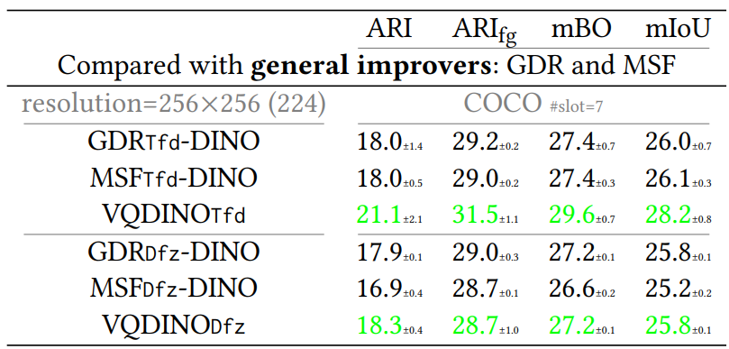

# GDR : Grouped Discrete Representation for Object-Centric Learning


## About

Official implementation of paper "*Grouped Discrete Representation for Object-Centric Learning*" available on [arXiv:2411.02299](https://arxiv.org/abs/2411.02299).

**GDR is *re-implemented* upon codebase [VQ-VFM-OCL](https://github.com/Genera1Z/VQ-VFM-OCL). For more details, models, checkpoints, datasets and results, please visit this repo.**

Quantative results:




## Converted Datasets 🚀

Dataset [COCO](https://cocodataset.org) is available on [dataset-coco](https://github.com/Genera1Z/VQ-VFM-OCL/releases/tag/dataset-coco), which is converted in LMDB database format and can be used off-the-shelf in this repo.


## Model Checkpoints 🌟

The checkpoints for all models are available.
- [slate-gdr-coco](https://github.com/Genera1Z/VQ-VFM-OCL/releases/tag/slate-gdr-coco): SLATE with GDR on COCO.
- [slotdiffusion-gdr-coco](https://github.com/Genera1Z/VQ-VFM-OCL/releases/tag/slotdiffusion-gdr-coco): SlotDiffusion with GDR on COCO.
- [slate-msf-coco](https://github.com/Genera1Z/VQ-VFM-OCL/releases/tag/slate-msf-coco): SLATE with MSF on COCO.
- [slotdiffusion-msf-coco](https://github.com/Genera1Z/VQ-VFM-OCL/releases/tag/slotdiffusion-msf-coco): SlotDiffusion with MSF on COCO.


## How to Use

#### (1) Install requirements

(Using Python version 3.11)
```shell
pip install -r requirements.txt
```
Use package versions no older than the specification.

#### (2) Prepare datasets (or use converted datasets)

Convert original datasets into LMDB format: 
```shell
python convert.py
```
But **firstly** download original datasets according to docs of ```XxxDataset.convert_dataset()```.

#### (3) Pretrain and train

Run training:
```shell
python train.py
```
But **firstly** change the arguments marked with ```TODO XXX``` to your needs.

Specifically on training:
- For SLATE/STEVE, there are two stages for training. For example,
```shell
# 1. pretrain the VAE module
python train.py --cfg_file config-slatesteve/vqvae-coco-c256-gdr.py
# *. place the best VAE checkpoint at archive-slatesteve/vqvae-coco-c256-gdr/best.pth
mv save archive-slatesteve
# 2. train the OCL model
python train.py --cfg_file config-slatesteve/slate_r_vqvae-gdr-coco.py --ckpt_file archive-slatesteve/vqvae-coco-c256-gdr/best.pth
```


#### (4) Evaluate

Run evaluation:
```shell
python eval.py
```
Remember **firstly** modify the script according to your need.


### About

I am now working on object-centric learning (OCL). If you have any cool ideas on OCL or issues about this repo, just contact me.
- WeChat: Genera1Z
- email: rongzhen.zhao@aalto.fi, zhaorongzhenagi@gmail.com


### Citation

If you find this repo useful, place cite our work.
```
@article{zhao2025gdr,
  title={{Grouped Discrete Representation for Object-Centric Learning}},
  author={Zhao, Rongzhen and Wang, Vivienne and Kannala, Juho and Pajarinen, Joni},
  journal={ECML PKDD},
  year={2025}
}
```
